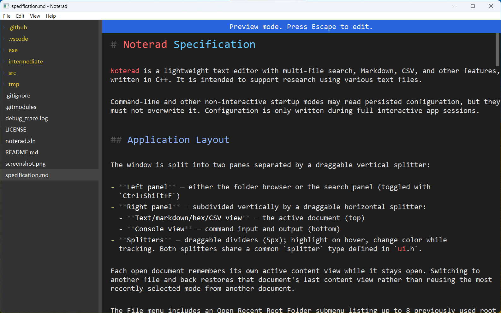

# Noterad

Noterad is a lightweight text editor with multi-file search, Markdown, CSV, and other features, written in C++.

Still a work in progress. (for about 10 years)

It has no dependencies and uses simple Win32 GDI rendering. It typically uses just a few megabytes of memory.

